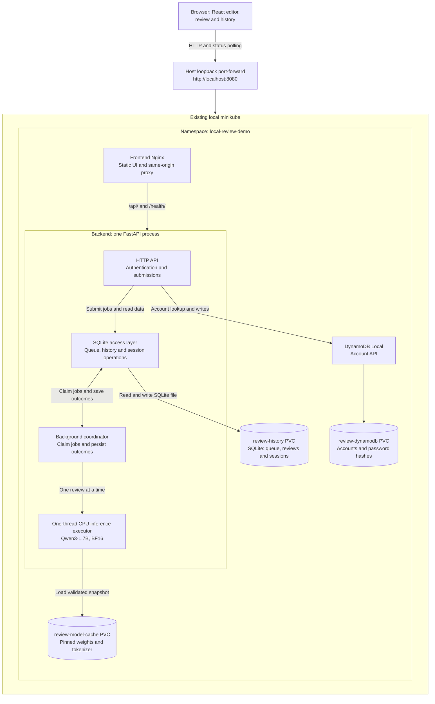
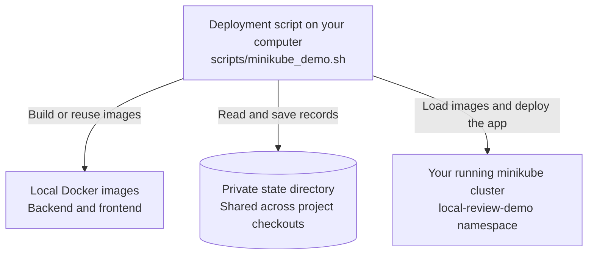

# LocalQwenDemo

**A local CPU-based LLM code-review service with automated deployment to an existing minikube cluster.**

Paste a code snippet, receive a structured review, and revisit it in your private history.
The React UI and FastAPI backend run `Qwen/Qwen3-1.7B` locally on CPU at a pinned revision.
Submitted code is treated as text: it is never executed or sent to an external inference API.
The maintained deployment uses a user-managed, native, single-node minikube with the Docker
driver. Local development tools are also available.

[Quick start](#quick-start) · [Architecture](#architecture) · [Documentation](#documentation) · [Development](#development-and-contributing)

## Key capabilities

- **Durable submissions:** SQLite atomically records jobs, enforces queue capacity and
  deduplicates matching request IDs per account. Queued work survives restart; interrupted running
  work has a bounded retry policy.
- **One inference at a time:** a background coordinator uses one CPU inference executor.
  Timed-out generation drains before another review can run; readiness reflects this state.
- **Private accounts and history:** password hashing, signed sessions, exact Origin and
  CSRF checks protect access. History is scoped to the authenticated account.
- **Reusable model cache:** startup checks every indexed weight shard and its structure,
  reuses a complete cache, and fails clearly if download or validation cannot complete.
- **Owned deployment and recovery:** minikube automation checks target identity and resource
  ownership, builds/loads local images, and reuses data. Shared state and locks support
  multiple checkouts; explicit import and cleanup paths handle recovery.

Generated findings still need human review. Structural quality checks do not establish
semantic correctness, and CPU performance depends on the host. This is a local single-node
service, not a validated highly available or publicly exposed production platform.

## Architecture

### Application and persistent data



The browser reaches Nginx through a host loopback port-forward. Nginx serves the React
bundle and proxies `/api/` and `/health/` to FastAPI on the same origin.

Inside the **single backend process**, the API writes jobs to the SQLite queue. A background
coordinator claims one job, runs it in the single inference executor, and writes the outcome
back to SQLite. The browser polls stored status; it does not wait for inference in the
submission request. The coordinator and executor are not separate services. The SQLite access layer is the
backend's existing storage code, not another database service; both API and coordinator
use it to access the same history PVC.

The three cylinders are separate PVCs. The backend uses the history and model-cache PVCs;
DynamoDB Local uses the accounts PVC. Cold startup may download the pinned snapshot from
Hugging Face; complete cached weights are reused and are not baked into application images.

### Deployment management



- **Deployment script:** checks the selected cluster and resource ownership before changing
  application resources. It connects with a private kubeconfig and explicit context/namespace.
- **Local Docker images:** built for the host's architecture, then loaded into the selected
  minikube cluster by the script. No remote registry push is required.
- **Private state directory:** stores target identities, build/deployment/acceptance records,
  kubeconfig and acceptance credentials. A shared target lock prevents concurrent operations
  from different checkouts. The default is
  `${XDG_STATE_HOME:-$HOME/.local/state}/local-qwen-demo/`.
- **Running minikube cluster:** supplied and managed by you. The script manages only this
  application's verified resources; it never creates, starts, resizes, stops or deletes
  the cluster, or reconfigures Docker, CNI or storage.

Checkout paths describe where source came from; they are not ownership proof. See
[architecture](docs/reference/architecture.md) for lifecycle and storage details and
[state management](docs/guides/minikube-demo.md#state-and-ownership-protection) for moves,
imports and identity checks.

## Quick start

### 1. Prepare the tools and cluster

Use macOS or Linux with Python 3.12, Docker, minikube and a kubectl compatible with the
cluster. Docker and the node must match the host architecture; no silent emulation is used.
Node 24 is needed for frontend development/tests, not the image-based deployment path.
Installation and the first image/model download need network access.

The backend alone requests **2 CPUs / 4 GiB RAM** and is limited to **2 CPUs / 6 GiB**.
Leave capacity for Kubernetes, the frontend, DynamoDB Local and other workloads. The three
PVCs request **10 GiB for history, 12 GiB for model cache and 1 GiB for accounts**;
hostpath sizes do not reserve physical disk.
`doctor` checks actual host, Docker and node budgets; unavailable measurements are not passes.

Run from your checkout; `/path/to/LocalQwenDemo` is a placeholder:

```bash
cd /path/to/LocalQwenDemo
python3.12 -m venv backend/.venv
backend/.venv/bin/python -m pip install -r backend/requirements-dev.lock
backend/.venv/bin/python -m pip install --no-deps -e backend
minikube profile list
```

If no suitable cluster is running, start one **yourself**. This example creates a new
Docker-driver profile; it is not an instruction to resize an existing cluster or a
promise that the resources will suffice:

```bash
minikube start --profile minikube --driver=docker --cpus=4 --memory=8192
```

Use your selected running profile in place of `minikube` below. The existing cluster must
provide supported minikube-hostpath storage (default class `standard`). See the
[deployment guide](docs/guides/minikube-demo.md) for full prerequisites and resource budgets.

### 2. Diagnose, deploy and open

Run diagnostics first:

```bash
scripts/minikube_demo.sh doctor --profile minikube
```

`doctor` returns nonzero for failed or incomplete diagnostics. If you choose to attempt
deployment, run `up` separately: resource/version findings become warnings, while target,
ownership, architecture and storage requirements still block unsafe deployment. Actual
build/load/apply/readiness failures remain failures; no `--force` is needed.

```bash
scripts/minikube_demo.sh up --profile minikube
scripts/minikube_demo.sh port-forward --profile minikube
```

Keep forwarding in its terminal and open **http://localhost:8080**. Use `localhost` exactly
for Origin matching. Register or log in and submit a snippet. First startup downloads the
pinned model; subsequent deployments reuse complete weights, accounts, signing Secret and
history. Slow or failed startup should be investigated with the
[troubleshooting runbook](docs/operations/recovery-and-cleanup.md), not by clearing data.

### 3. Validate or clean up deliberately

A successful `up` establishes application readiness, not a completed user review.
`verify` creates acceptance accounts/reviews and performs controlled persistence checks,
including workload recreation. Read the [acceptance procedure](docs/guides/minikube-demo.md#acceptance-procedure)
and close your own foreground port-forward with Ctrl-C before using the same saved port:

```bash
scripts/minikube_demo.sh verify --profile minikube
```

A real completed review, persistence acceptance, full API `verify`, and deployed-browser
acceptance are separate results. Historical passes do not validate a new checkout.

[Normal undeploy](docs/guides/minikube-demo.md#undeploy-and-recovery) preserves the three
PVCs, signing Secret and ownership information by default. Full purge needs explicit
confirmation. [Lost-state recovery](docs/operations/minikube-lost-state-recovery.md) is a
separate, read-only-by-default preview for deliberate data abandonment; neither path
adopts unknown resources. Never delete state files to bypass ownership errors.

## Documentation

| Reader task                  | Start here                                                                                                                                 | What you will find                                                                    |
| ---------------------------- | ------------------------------------------------------------------------------------------------------------------------------------------ | ------------------------------------------------------------------------------------- |
| Getting started              | [Minikube guide](docs/guides/minikube-demo.md)                                                                                             | Prerequisites, deployment, access and acceptance                                      |
| Architecture and design      | [Architecture](docs/reference/architecture.md), [security](docs/reference/security.md)                                                     | Request flow, queue lifecycle, storage and trust boundaries                           |
| Development and testing      | [Local development](docs/guides/local-development.md), [testing](docs/testing/README.md)                                                   | Setup, fake-model/Compose tools, offline gates and real acceptance boundaries         |
| Deployment and operations    | [State management](docs/guides/minikube-demo.md#state-and-ownership-protection), [observability runbook](docs/operations/observability.md) | Cross-checkout management, trusted imports and safe diagnostics                       |
| Troubleshooting and recovery | [Startup and cleanup](docs/operations/recovery-and-cleanup.md), [lost-state recovery](docs/operations/minikube-lost-state-recovery.md)     | Failure investigation and distinct data-preserving/destructive cleanup paths          |
| Reference                    | [Documentation index](docs/README.md#reference)                                                                                            | API, model, CLI, logging and resource contracts                                       |
| Historical validation        | [Dated reports](docs/reports/README.md)                                                                                                    | Original environments, measured results and limitations; no current acceptance claims |

The [documentation index](docs/README.md) explains reading paths and where each subject
is maintained. Project documentation and fixed output use English; user input and model
output retain their original language.

## Development and contributing

After the Python setup above, install Node 24 dependencies and run the offline gate:

```bash
npm --prefix frontend ci
bash scripts/check.sh
```

The gate uses model/cluster doubles, temporary loopback fixtures and offline Kustomize
rendering. It does not download weights, build container images or deploy. Browser tests
use a separate fake-model harness; real inference and environment acceptance are opt-in
operations. See [testing](docs/testing/README.md) for prerequisites and coverage limits.

For a change, follow [local development](docs/guides/local-development.md), add focused
regressions, and update the owning reference or guide. Keep private state, credentials,
user data, weights and generated artifacts out of commits. Explain which checks actually
ran and preserve any skipped, failed or unmeasured result.
