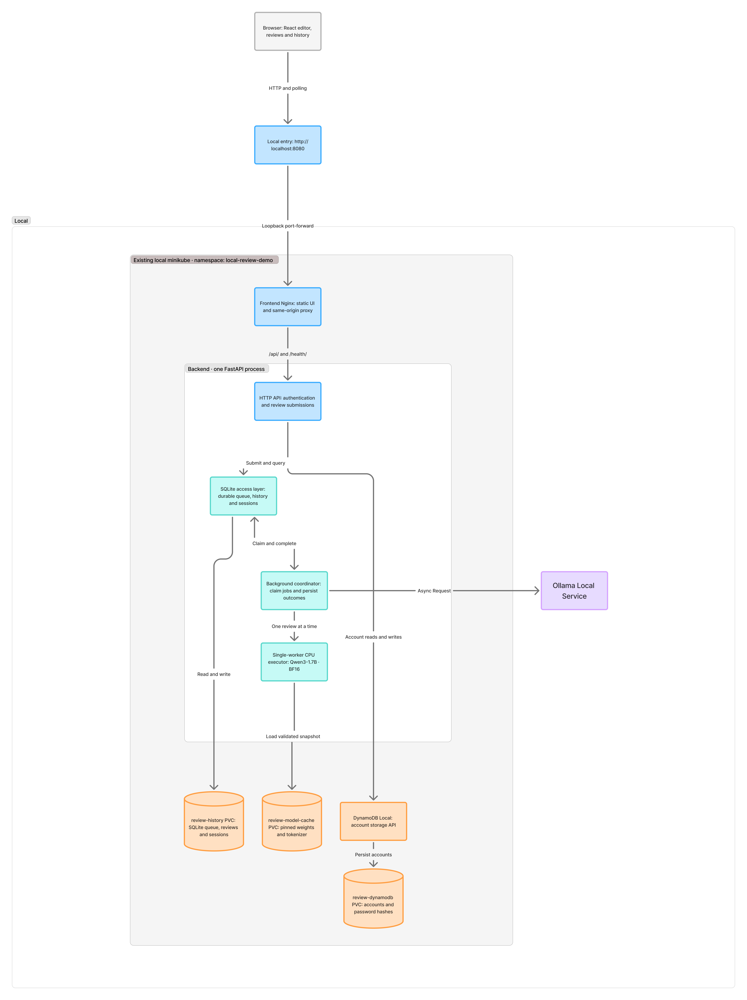

# LocalQwenDemo

Standard Helm deployment and release automation: [guide](docs/guides/helm-release.md).

**A local LLM code-review service with native Ollama inference and standard Helm deployment to an existing Minikube cluster.**

Paste a code snippet, receive a structured review, and revisit it in your private history.
The React UI and FastAPI backend run in minikube; native host Ollama runs `qwen3:1.7b`
Q4_K_M at a pinned digest. An explicit Transformers CPU backend remains available.
Submitted code is treated as text: it is never executed or sent to a cloud inference API.
The maintained deployment uses a user-managed, native, single-node minikube with the Docker
driver. Local development tools are also available.

[Ollama acceptance](docs/reports/ollama-integration-2026-10-03.md) · [Quick start](#quick-start) · [Architecture](#architecture) · [Documentation](#documentation) · [Development](#development-and-contributing)

## Key capabilities

- **Durable submissions:** SQLite atomically records jobs, enforces queue capacity and
  deduplicates matching request IDs per account. Queued work survives restart; interrupted running
  work has a bounded retry policy.
- **One inference at a time:** a background coordinator uses one inference executor.
  Timed-out generation drains before another review can run; readiness reflects this state.
- **Private accounts and history:** password hashing, signed sessions, exact Origin and
  CSRF checks protect access. History is scoped to the authenticated account.
- **Verified model identity:** Ollama startup verifies its digest, template and tokenizer;
  saved reviews retain the actual model digest. The CPU backend validates cached weight shards.
- **Reviewed Helm releases:** CI builds images and proposes immutable deployment
  snapshots; approved releases install with standard Helm commands and explicit
  environment values. Existing Secrets and persistent volumes survive upgrades.

Generated findings still need human review. Structural quality checks do not establish
semantic correctness, and CPU performance depends on the host. This is a local single-node
service, not a validated highly available or publicly exposed production platform.

## Architecture

### Application and persistent data

[](docs/assets/application-architecture.png)

[Open full-size image](docs/assets/application-architecture.png) ·
[Edit the diagram in FigJam](https://www.figma.com/board/d9AFwjvFYGB7qWsFZNrWCO/LocalQwenDemo-%E2%80%94-Application-Architecture?node-id=0-1)

The diagram describes the retained Transformers CPU path. In the default Ollama
path, the executor calls host Ollama through `host.minikube.internal:11434`; the model
weights and GPU computation are outside the cluster.

The outer boundary is the minikube namespace `local-review-demo`; the inner boundary
is one FastAPI backend process. Re-export the FigJam board after editing it to update
this image.

The browser reaches Nginx through a host loopback port-forward. Nginx serves the React
bundle and proxies `/api/` and `/health/` to FastAPI on the same origin.

Inside the **single backend process**, the API writes jobs to the SQLite queue. A background
coordinator claims one job, runs it in the single inference executor, and writes the outcome
back to SQLite. The submission request returns before inference; the browser polls
stored status. The coordinator, executor and SQLite access layer run within the backend.
The API and coordinator use that layer to access the same history PVC.

The three cylinders are separate PVCs. The backend uses the history and model-cache PVCs;
DynamoDB Local uses the accounts PVC. Ollama uses host-managed weights and a pinned
tokenizer cached in the backend PVC. The CPU adapter downloads/reuses its pinned HF
weights there. Model weights are not baked into application images.

### Deployment management

GitHub Actions builds application images and proposes a reviewed snapshot on
`deployment-release`. The snapshot contains the Chart, image digests and a
Minikube environment example. Deploy it with Helm; prepare the cluster, host
Ollama and namespace Secrets separately. No Python deployment wrapper is required.

The [deployment guide](docs/guides/helm-release.md) documents configuration,
installation, upgrades, status, rollback and data retention. Argo CD can later
render the same Chart, with one manager per deployment.

The previous [deployment diagram](docs/assets/deployment-management.png) and
[legacy Minikube guide](docs/guides/minikube-legacy.md) describe the retained
legacy scripts. Those scripts must not manage a Helm-owned deployment.

## Quick start

For local source development, the optional script builds/loads images and calls
standard Helm. Prepare an existing Minikube and host Ollama, then run:

```bash
scripts/minikube_demo.sh init --profile minikube
scripts/minikube_demo.sh up --profile minikube
scripts/minikube_demo.sh verify --profile minikube
scripts/minikube_demo.sh port-forward --profile minikube
```

See the [local Helm guide](docs/guides/minikube-demo.md) for configuration,
rollback and data-preserving/full cleanup. Stop foreground port-forward before
running verify. Helm commands remain usable independently of this script.

For published release snapshots:

1. Prepare an existing Minikube cluster (start with 4 CPUs / 8 GiB), its `standard`
   StorageClass, and reachable host Ollama with the pinned model.
2. Check out an approved `deployment-release` snapshot. Follow the
   [one-time setup](docs/guides/helm-release.md#one-time-namespace-and-secret-preparation)
   to create a fresh namespace and stable signing Secret. Private GHCR images
   also require an image pull Secret.
3. Copy the provided Minikube values outside the checkout, adjust the environment,
   and follow the [standard Helm installation](docs/guides/helm-release.md#configure-inspect-and-install).
   Pass `release-values.yaml` before your environment file on every upgrade.
4. Port-forward `service/review-frontend`, open `http://localhost:8080`, and complete
   a real review. Kubernetes readiness alone is not model acceptance.

The local example disables NetworkPolicy isolation. The guide explains how to
supply an explicit host CIDR and enable policies with a capable CNI. Source users
can run `helm lint` and `helm template` with
`deploy/helm/local-review/values-minikube.yaml` without a cluster; deploying source
also requires actual application images.

## Documentation

| Reader task                  | Start here                                                                                                                                 | What you will find                                                                    |
| ---------------------------- | ------------------------------------------------------------------------------------------------------------------------------------------ | ------------------------------------------------------------------------------------- |
| Getting started              | [Helm deployment](docs/guides/helm-release.md)                                                                                             | Prerequisites, deployment, access and acceptance                                      |
| Architecture and design      | [Architecture](docs/reference/architecture.md), [security](docs/reference/security.md)                                                     | Request flow, queue lifecycle, storage and trust boundaries                           |
| Development and testing      | [Local development](docs/guides/local-development.md), [testing](docs/testing/README.md)                                                   | Setup, fake-model/Compose tools, offline gates and real acceptance boundaries         |
| Deployment and operations    | [Helm lifecycle](docs/guides/helm-release.md#status-uninstall-and-rollback), [observability runbook](docs/operations/observability.md) | Helm status, rollback, retained storage and diagnostics                       |
| Legacy script recovery       | [Startup and cleanup](docs/operations/recovery-and-cleanup.md), [lost-state recovery](docs/operations/minikube-lost-state-recovery.md)     | Failure investigation and distinct data-preserving/destructive cleanup paths          |
| Reference                    | [Documentation index](docs/README.md#reference)                                                                                            | API, model, CLI, logging and resource contracts                                       |
| Historical validation        | [Dated reports](docs/reports/README.md)                                                                                                    | Original environments, measured results and limitations; no current acceptance claims |

The [documentation index](docs/README.md) maps each task to its main guide or reference.
Project documentation and fixed output use English; user input and model
output retain their original language.

## Development and contributing

Follow the Python setup in [local development](docs/guides/local-development.md),
then install Node 24 dependencies and run the offline gate:

```bash
npm --prefix frontend ci
bash scripts/check.sh
```

The gate uses model/cluster doubles, temporary loopback fixtures and offline Kustomize
rendering. It does not download weights, build container images or deploy. Browser tests
use a separate fake-model harness; real inference and environment acceptance are opt-in
operations. See [testing](docs/testing/README.md) for prerequisites and coverage limits.

For a change, follow [local development](docs/guides/local-development.md), add focused
regressions, and update the owning reference or guide. Keep private state, credentials,
user data, weights and generated artifacts out of commits. Explain which checks actually
ran and preserve any skipped, failed or unmeasured result.
