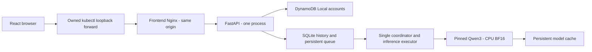

# Architecture

Audience: maintainers. Purpose: understand component and persistence boundaries. Prerequisites: basic familiarity with the root README; no running environment required.

[Documentation index](../README.md)

## Request flow

## Boundaries

The browser edits and displays text. The frontend serves the UI and proxies `/api/*`
and `/health/*` to `review-backend:8000`, preserving normal Cookie, Origin and CSRF
handling. FastAPI validates the session/account, input bounds and idempotency before
atomically persisting a queued review. The HTTP request ends before inference; the
browser polls the persisted status and renders only sanitized completed Markdown.
The cluster is accessed through an explicitly owned loopback forward, not a public ingress.

One Uvicorn process and one background coordinator own a dedicated one-thread inference executor. One review invokes that executor once and performs its Summary, Findings, and Suggestions generations sequentially inside the same call. The sections share one 384-token deployment budget split 72/176/136, one deadline, and one stop event; no section output becomes a later model instruction. If an individual section reaches its fixed limit, the backend may delete only its incomplete trailing fragment after the last complete terminator. It never adds a continuation call or alters an earlier complete sentence or list item. Qwen3's tokenizer chat template is always invoked with the hard `enable_thinking=False` switch, so the application neither requests nor parses chain-of-thought. Each section uses the pinned model's explicit non-thinking sampling parameters and a stable SHA-256-derived seed inside an isolated CPU RNG context. Exiting the context restores the process RNG state, and neither seed nor source-derived hash is logged or persisted. Repeatability is scoped to the same dependency, CPU, and runtime stack. DynamoDB and SQLite operations run in FastAPI's thread pool or `asyncio.to_thread`; model execution never runs on the main event loop. One backend replica and the `Recreate` rollout strategy preserve this ownership. There is no HPA, distributed queue, conversational store, external LLM, or code execution path.

## Storage

`backend/app/storage.py` is a small maintainable SQLite abstraction with parameterized queries, explicit transactions, and schema versioning through `PRAGMA user_version`. Version 1 is created atomically; unknown versions fail startup. Future schema changes must introduce explicit ordered migrations before increasing the supported version. SQLite uses WAL, `synchronous=FULL`, and a five-second busy timeout. Each operation creates and closes its own connection.

Reviews contain all required fields: review/user/client IDs, language, source, result, state, error code/message, model ID/revision, retry count, and creation/update timestamps. Indexes cover user/reverse time ordering, status/creation ordering, and a unique `(user_id, client_request_id)` key. Transactions serialize duplicate submissions and capacity checks. A duplicate key with identical input returns the existing job, even after completion; a changed payload returns 409.

History listings are cursor-paginated and omit source/result text. Detail access and pagination cursors always derive user identity from the authenticated session. Another user's ID returns 404. User input never supplies authoritative `user_id` values.

Sessions are signed opaque random tokens; only a SHA-256 token hash, user identity, CSRF token, and expiry are stored in SQLite. Logout deletes the session, so replaying a copied cookie fails. DynamoDB stores account identifiers, Argon2id hashes, creation timestamps, disabled flags, and opaque user IDs. It does not store review history.

## Queue and restart policy

There may be eight queued jobs plus one running job by default, and at most one active job per account. Admission and status transitions are persisted before HTTP acceptance or inference. History writes fail closed: no success is returned when storage fails.

On process restart, queued jobs are recovered. Stale running jobs are requeued once, incrementing `retry_count`. A second interruption fails them as `interrupted`. A reduced queue capacity preserves the oldest jobs and fails excess recovered work. Ordinary inference failures, empty or invalid output, and timeouts are not automatically retried; the user may make a new submission.

A timed-out inference is marked failed, receives a cooperative stopping signal, and makes readiness false until its thread exits. The three section generations do not receive separate timeout windows: the 300-second minikube inference deadline covers the complete review, and stop or deadline expiry prevents another section from starting. No second inference is started during draining. If the inference thread exits within the existing 30-second draining window, readiness recovers, liveness remains healthy, and the Pod is not restarted. Only draining that exceeds 30 seconds enters `inference_stuck`, makes liveness false, stops the coordinator, and causes Kubernetes to restart the process. Python cannot forcibly kill a native thread. The 60-second pod termination grace period bounds shutdown even if native execution becomes stuck. A killed running job is recovered under the documented retry policy.

## Deployment and persistence

`deploy/kustomize/overlays/minikube` is the sole maintained deployment overlay. Its local
base describes hardened application resources. A namespace-scoped signing Secret is
created once by the deployment script and reused. Three independent PVCs hold history/
queue/sessions, model cache and DynamoDB Local accounts. Existing supported hostpath
storage and CNI are inspected, never installed or reconfigured by the scripts.

The minikube helpers verify profile/home/cluster identity, use a private kubeconfig and
shared operation lock, and enforce namespace UID and random ownership markers. Source
fingerprints, unique local image tags and image IDs bind deployment/verification to the
actual checkout. [State import and cleanup](../guides/minikube-demo.md#state-and-ownership-protection)
work across checkout moves. Readiness and acceptance have independent reports.

## Observability flow

The backend emits allowlisted JSON events to stderr. The `logs` command filters these
again for operator inspection. No cloud collector, metrics exporter or automated alarm
service is installed. [The log contract](observability.md) and [local runbook](../operations/observability.md)
define safe correlation, timing boundaries and unknown measurements.

## Frontend progress estimate

While a review is submitting, queued or running, the result panel shows a coarse 200–300 second model-time estimate from current source length relative to the session character limit. It is not a countdown or SLA: queueing, cold startup, model loading and host load may extend total wait. The estimate does not change the 300-second minikube inference timeout.
