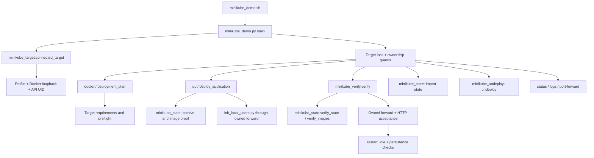

# Script catalog and call chains

Use this catalog to check command requirements and side effects. Set up the [local environment](../guides/local-development.md) and the tools listed below. Run examples from the repository root, invoking Python files through `backend/.venv/bin/python`. Shell entries are executable.

## Local commands and checks

| Entry / invocation | Inputs, options and environment | Dependencies | Output, generated files and effects |
| --- | --- | --- | --- |
| `bash scripts/check.sh` | No options; do not export `RUN_REAL_MODEL=1` for routine checks | Python dev lock, npm dependencies, kubectl | Lint/format, backend tests, frontend lint/tests/build, local script regressions, minikube structural checks; caches and `frontend/dist`; fail-fast nonzero; no install/build-image/deploy |
| `scripts/check_scripts.sh` | No options; calls the focused entry below, the evaluator double-only tests, local initializer tests and actual manifest validation | Python dev lock, Bash, Python 3, kubectl | Shell syntax includes all maintained entry points; temporary test files/loopback children only; no real cloud/cluster writes |
| `scripts/check_minikube_demo.sh` | `REVIEW_PYTHON` overrides default `backend/.venv/bin/python` | Ruff, pytest, HTTPX, PyYAML, kubectl | Lint/format and all Python minikube test files; real offline render and loopback socket/process tests; no cluster |
| `backend/.venv/bin/python scripts/local_demo.py --fake-model` | `--fake-model` opt-in; **default uses real model**; `--port` default 8000; `--data-dir` default `.local/demo` | Dev lock; optional model lock/Torch when real | Loopback API; Moto accounts reset and random signing key changes on restart; persistent SQLite in data dir; real mode may download pinned weights to `.local/models/huggingface` |
| `backend/.venv/bin/python scripts/init_local_users.py` | No CLI parser/options; required explicit `DYNAMODB_ENDPOINT_URL`; only loopback with an explicit port allowed; fixed dummy credentials | boto3, running DynamoDB Local | Describes and idempotently creates `llm-review-users`; **local database write**. Do not invoke with `--help`: it is not a help-capable script |
| `backend/.venv/bin/python scripts/validate_manifests.py` | No CLI parser/options; minikube overlay fixed relative to script root | PyYAML, kubectl | Offline `kubectl kustomize`, assert resource/security/model contracts; console only. `--help` would still execute validation |

Test fixtures are covered in [testing](../testing/README.md#mock-boundaries-and-fixture-maintenance). Scripts return nonzero on failed assertions/subcommands; aggregate gates stop on first failure rather than silently skipping missing tools.

## Current-model evaluation entry

`backend/.venv/bin/python scripts/evaluate_model.py` creates a content-free plan only. Options: `--dry-run`, `--run-real-model` (mutually exclusive), `--case all|hello_world|average|square|first_item|sql_injection|prompt_injection`, `--cache-dir HF_HOME`, and explicit `--review-in-terminal` for a private synthetic-output view and human verdicts. There is no model/parameter/source override.

Plans require the Python dev environment; real execution also requires model packages and a complete pinned offline cache. Host `.env`/model overrides are ignored. Real-worker HF offline/telemetry/token settings and `OMP_NUM_THREADS=2` are fixed and recorded.

The fixed input is `scripts/evaluation/fixtures-v1.json`; output is a new private `.local/model-evaluations/<time>-run-<random>/report.json`. Default mode creates only reports and reads local Git/dependency metadata. Real mode consumes CPU/RAM, uses one owned supervised worker and never downloads, installs, starts services or touches AWS/cluster resources. Model output is neither logged nor exported by default.

Exit 0 means a valid `not_run` plan or a real `passed` result, distinguished in the report; exit 1 means failure, 2 invalid arguments, 3 pending human review. Complete semantic acceptance requires the explicit terminal judgments. Read the [evaluation guide](../testing/model-evaluation.md) for rules, commands, resource budgets and privacy; historical reproduction limitations belong to the [material audit](../reports/model-evaluation-materials-2026-09-25.md). The shared gate runs only `test_model_evaluation.py` with doubles, never this real-inference entry.

## Minikube public entry

`scripts/minikube_demo.sh COMMAND [OPTIONS]` resolves the checkout from its own path and execs `minikube_demo.py` using `REVIEW_PYTHON` or the backend virtual environment. The Python file may also be invoked directly; both entries use the same CLI. Operational commands require macOS/Linux, Python dev dependencies, local Docker, minikube and kubectl. Help parses before discovery; `stop` prints advice and performs no external operations.

| Command | Preconditions and actual effects |
| --- | --- |
| `doctor` | Discover/select a running target and read resource/version/storage diagnostics; temporary private kubeconfig; reads Docker/cluster and may execute diagnostic commands in the owned backend; no resource mutations. Nonzero for failed or missing diagnostics |
| `up` | Authorization required: mandatory target/ownership/native-architecture/storage checks, private target state/lock, advisory diagnostics, native image build/reuse/load, namespace/Secret/PVC/workload changes, local users table initialization and readiness waits; model download may follow. Does not start/resize clusters, rotate existing key or push images |
| `verify` | Authorization required: matching completed deployment/build evidence before HTTP/account/review writes; real inference, isolation checks, controlled workload recreation and persistence checks. Produces report and private acceptance credentials |
| `port-forward` | Completed deployment record and saved port; creates an owned foreground loopback kubectl child and cleans it up on exit; no unknown process termination |
| `status` | Existing valid ownership; reads selected resources/CNI, opens target operation lock; no workload changes |
| `logs` | Existing valid ownership; reads and filters structured safe backend events; local lock, no workload changes |
| `import-state` | Verify the selected live target and legacy ownership, copy privately under old/shared locks, preserve original records; no cluster mutations |
| `undeploy` | Require trusted ownership and an idle, non-draining backend; fence ingress/admission, delete owned runtime resources with UID/version preconditions; preserve data by default. Explicit confirmed purge additionally deletes owned PVCs/Secret; namespace remains |
| `inspect-target` | Explicit profile; verified private target connection; print public cluster/namespace/owner identities without importing state or changing resources |
| `recover-cleanup` | Explicit profile and expected cluster/namespace/owner identities; read-only preview by default. Confirmed `--execute --purge-data --confirm-data-loss local-review-demo` uses a complete inventory and queue fence before conditional full cleanup; independent private recovery journal |
| `stop` | Compatibility advice only, exit zero; does not stop forwarding, workloads or minikube |

Options:

- `--profile NAME` selects an existing running profile; required when multiple profiles are running.
- `--minikube-home PATH` overrides `MINIKUBE_HOME` / `~/.minikube`.
- `--storage-class NAME` selects an existing minikube-hostpath class for `up` (default `standard`).
- `--port N` selects the localhost HTTP port for `up` (default 8080; 1024–65535).
- `--cold-timeout N` defaults to 3600 seconds, `--warm-timeout N` to 600 (minimum 60).
- `--skip-restart` makes `verify` partial and nonzero.
- `-h/--help` prints help.

No force/skip-ownership option exists. Runtime errors exit 1; argparse errors exit 2; interruption exits 130.

Generated target data: `${XDG_STATE_HOME:-$HOME/.local/state}/local-qwen-demo/targets/<profile>-<home-hash>/<cluster-uid>/` contains `owner.json`, `plan.json`, `startup.json`, `deployment.json`, `verification.json`, `undeployment.json`, independent `recovery-cleanup.json`, `kubeconfig`, private `acceptance-account.json` and archived `attempts/`. Shared locks live in `<state-root>/locks/`. `LOCAL_QWEN_STATE_HOME` or `--state-root` overrides the root. `--from-state` supplies an explicit legacy checkout/state source. `undeploy --purge-data --confirm-data-loss local-review-demo` explicitly deletes owned data; `--delete-timeout` bounds waits (1–600 seconds, default 120). Reports distinguish diagnostic findings, readiness, review completion, persistence and UI acceptance. Never share credential files or manufacture missing image proof. See [recovery and acceptance](../guides/minikube-demo.md) for the detailed procedure.

Lost-state recovery additionally requires `--expect-cluster-uid`, `--expect-namespace-uid` and `--expect-owner`; `--restore-frontend` is a separate identity-protected restoration action. Recovery never imports state automatically. Read the [lost-state recovery procedure](../operations/minikube-lost-state-recovery.md) before using these options.

Internal modules have no standalone CLI:

| Module | Responsibility / callers |
| --- | --- |
| `minikube_target.py` | `connected_target` selects/verifies home/profile/API/cluster UID; temporary kubeconfig is removed on exit. `deployment_requirements` enforces hard constraints; `preflight` measures advisory capacity; fingerprints support image reuse |
| `minikube_state.py` | Validate owner/plan/deployment/attempt consistency; preserve prior reports; bind source, local Docker image and loaded CRI image proof. Lazy `api()` resolves the active CLI's selected target |
| `minikube_verify.py` | Called under the CLI lock after target/ownership guards; validates state/images, exercises real HTTP/inference, restarts idle owned workloads, records bounded evidence. No UI automation |
| `minikube_store.py` | Private shared state paths, target-wide locks, checked atomic import and missing-namespace history recovery |
| `minikube_undeploy.py` | Safe resource inventory, queue/admission fencing, UID/version-conditional deletion and recoverable cleanup journal |
| `minikube_recovery.py` | Lost-state preview, strict UID ownership chains, PV policy inspection, confirmed namespace cleanup and independent recovery journal |
| `minikube_demo.py` | CLI orchestration, safe subprocess boundary, resource ownership, atomic state writes, bounded forwarding, deployment stages and replica restoration |

The CLI selects the target before dispatch; `doctor`, import and cleanup share the same target lock across checkouts. `up` uses mandatory checks independently of `doctor`'s diagnostic verdict. All sibling modules share the selected CLI state; they do not discover an alternate target.

## Verification entry chain

`scripts/check.sh` runs backend lint/tests, frontend lint/tests/build, then
`scripts/check_scripts.sh`. The script gate syntax-checks Shell entries, runs all
minikube test modules, runs the evaluator/local-initializer regression suites and
validates the actual minikube render. Tests use temporary state, API doubles and
loopback servers; no real cluster or model is needed.

Browser tests are separate locally; CI also runs them with the fake-model harness.
CI's pull-request image checks build local images without publishing; these are not
part of `check.sh`. No workflow deploys or provisions a cloud environment. See the
[test matrix](../testing/README.md#test-matrix) for boundaries and manual acceptance.
